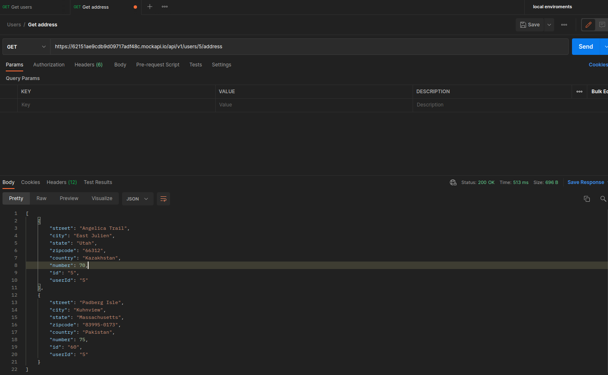
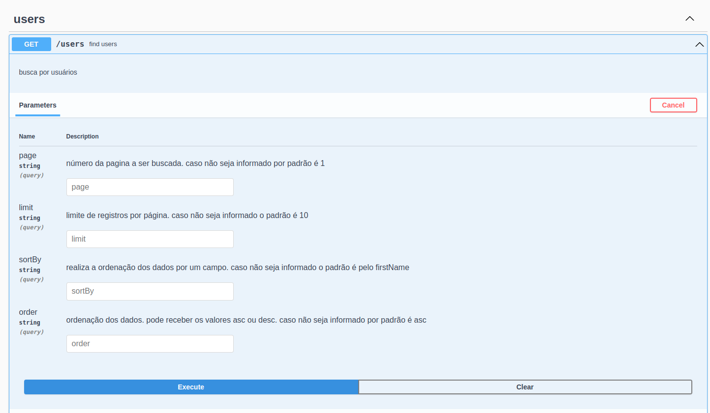

# Challenge semantix

## tecnologias utilizadas
Para o projeto foi utilizado as seguintes tecnologias:
* Nodejs v16.x
* Typescript v4.6.x
* Express v4.x
* Docker v20.x.x
* Jest v27.x.x

## Algumas considerações
* infelizmente não consegui utilizando os child_process do nodeJS. por isso optei por utilizar Promise.all e otimizar ao máximo que consegui a execuções das requisições.
* no momento que estou realizando o teste o paramêtro **countryCode** não está sendo enviado na api de endereços.

* enviei o código com o .env file para facilitar a execução. porém sei que o ideal é que este arquivo não seja enviado para o repositório remoto.

## Como executar

### Com docker
Caso tenha o docker instalado e queira utilizar é necessário apenas acessar a página do projeto e executar o seguinte comando no terminal:
* **docker-compose up -d** o docker vai fazer o build do container e iniciar a aplicação

caso queira acompanhar os logs da aplicação é necessário apenas executar o seguinte comando no terminal:
* **docker container logs -f challenge-semantix**

### Com o node instalado na máquina
Caso queira executar com o node na máquina é necessário ter o node v16.x ou posterior instalado, e apenas acessar a pasta do projeto no terminal e executar os seguintes comandos:

* **npm run install** ou **npm run i** para instalar as dependências
* **npm run dev** para executar o projeto

## Rotas da aplicação
com o projeto em execução para realizar uma request para a rota cadastrada é necessário ou ter algum software instalado:
* Postman ->  [Postman](https://www.postman.com).
* Insomnia -> [Insomnia](https://insomnia.rest/download).

Após isso é necessário realizar uma requisição get para o endereço
* [http://localhost:3333/users](http://localhost:3333/users).
* A rota aceita os seguintes paramêtros opcionais:
* **page** - número da pagina a ser buscada. caso não seja informado por padrão é 1
* **limit** - número de registros por busca. caso não seja informado o padrão é 10. o limite por busca são de 15 registros
* **sortBy** - realiza a ordenação dos dados por um campo. caso não seja informado o padrão é pelo firstName. lista de campos disponíveis para sort dos dados:
* id
* createdAt
* firstName
* email
* lastName

* **order** - paramêtro para ordenação dos dados. caso não seja informado por padrão é asc. é aceito pela api ou **asc** ou **desc**

ou utilizando o próprio swagger configurado no projeto. para utilizar o swagger é necessário apenar acessar em qualquer navegador o endereço:

* [swagger](http://localhost:3333/api-docs)

Após acessar a interface do swagger é necessário apenar abrir a rota users cadastrada e clicar no botão execute

## Testes da API
Caso deseje executar os testes é necessário apenas acessar a raiz do projeto por qualquer terminal e executar o seguinte comando:
* **npm run test** - sem exibir a cobertura dos testes
* **npm run test:coverage** -- com cobertura dos testes
